# Learning to Paint
This project is inspired by the original [ICCV2019 paper](https://arxiv.org/abs/1903.04411). We built an agent that can draw paintings like how human do, using a neural renderer combined with Deep Reinforcement Learning. It would decompose a given image into strokes and then apply each stroke onto an empty canvas to create a visual simlar output. After we 1) re-implement essential parts and recover the result from the paper, we focus on 2) applying the technique to a Chinese character dataset and improve RL performance; 3) adding a style transfer into the architecture so that the agent can draw image with given style.

## Table of Contents
- [Introduction](#introduction)
- [Related Work](#related-work)
- [General Approach](#general-approach)
- [Learning to Write Chinese Characters](#learning-to-write-chinese-characters)
  - [Modifications](#modifications)
- [Learning to Paint with Style](#learning-to-paint-with-style)
  - [Discussion](#discussion)
  - [Visual Results](#visual-results)
  - [Cross-Section Result](#cross-section-result)
- [Conclusion](#onclusion)

## Introduction
No matter in which forms of art, it always comprises the process of perception, understanding, and expression. The expression step shows the wisdom and creativity of human beings. Different people have different idea about an object and they would use different styles to express their feeling. Specifically, painting has been a mainstream form of art for decades. Most people spend a huge amount of time to master this skill. It would be an interesting work to teach machines how to paint. *Huang et al.* introduces an idea about employing a neural renderer in model-based Deep Reinforcement Learning to get an agent learn to make long-term plans to decompose images into strokes. The agent also learns to determine the position and color of each stroke. We recovered their work with our own implementation and then extended based on that. 

To fully explore different aspects of the original model, we took two seperate approaches in terms of innovations on top of the original paper. Since the original project operates on images, our two approaches focused on the structure of images and the texture of imagesm, respectively.

To explore how the model works the best to extract the structure of an image, we first attempted to modify the model so that instead of painting an given image, it writes a Chinese character stroke by stroke when given a image of such a character. The focus of this section is to modify the model so that during training, it focus more on the structure of the given image, instead of the texture so that it writes a clean Character.

On the other hand, to explore how the model works the best to extract the texture of an image, we then attepmted to modify the orginal model so that the agent can draw a given image with different style. Nerual Style Transfer has alway been a popular topic over years. Now, we combine the idea with our model to generate a painted image with desired styling. In this section of our project, we focused on how to perserve the feature of the original model that it extracts good textures from the original image and then further apply style transfer on top of that.

## Related Work

Our work is highly related to [ICCV2019-Learning to Paint](https://github.com/megvii-research/ICCV2019-LearningToPaint) and [PyTorch-Multi-Style-Transfer](https://github.com/zhanghang1989/PyTorch-Multi-Style-Transfer). We apply the idea from the former and use partial codes from both repo to train our model.

## General Approach

Here are graphs representing the overall architecture of training and testing. In different sections, we will mention which parts we implemented by ourselves and which parts we adopted original implementation.

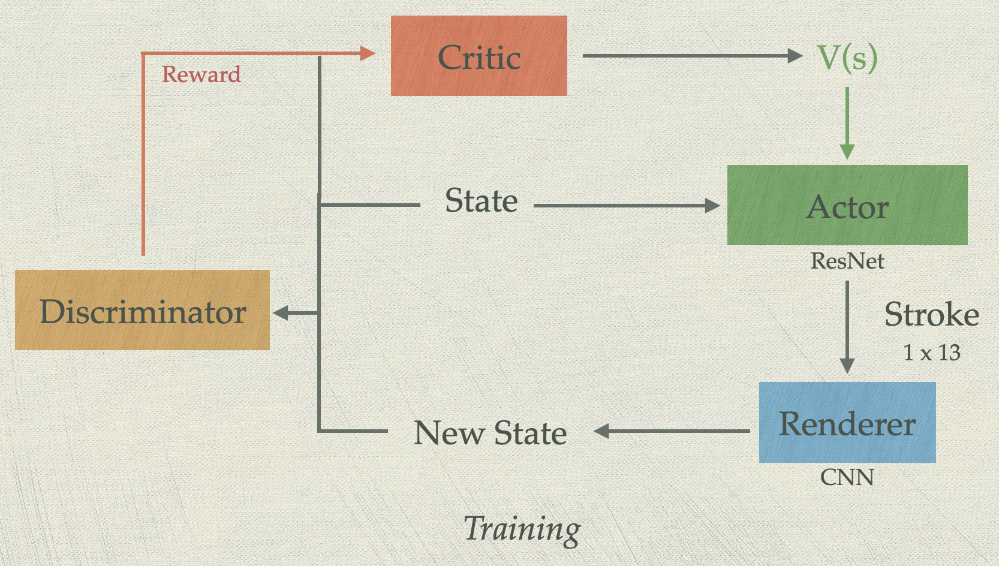
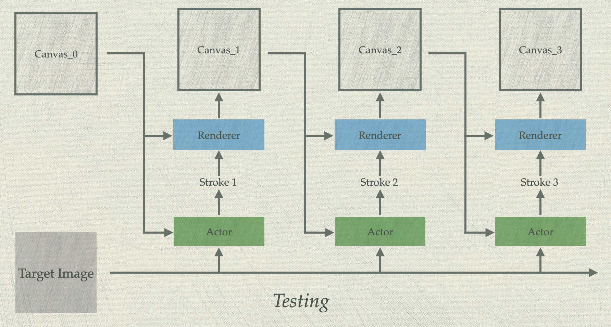

<ul>
<li> State: The target image, current canvas, and step number
<li> Actor: Generate actions (strokes) based on states
<li> Renderer: Render the new state as the action applied on the current canvas
<li> Discriminator: Generate Wasserstein distance from states to target image. The difference between the state ane new state is the reward for current state. 
<li> Critic: Predict value function for current state
</ul>

## Learning to Write Chinese Characters
Upon successful replication of the original work, we first modified the model so that it can write a Chinese character stroke by stroke when given an image of such character.

### Modifications
The original model does not work well on our specific task because when it is given an image of a character, it attempts to draw that character using small an thick strokes full of textures. However, when a human writes a character, the strokes used are typically long and thick strokes. Below is an example of how the original model fails at our task:

Target image of "深"    |  Target image of "度"
:-------------------------:|:-------------------------:
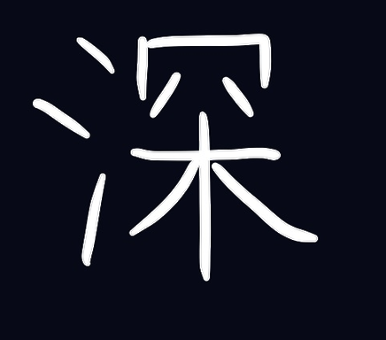  |  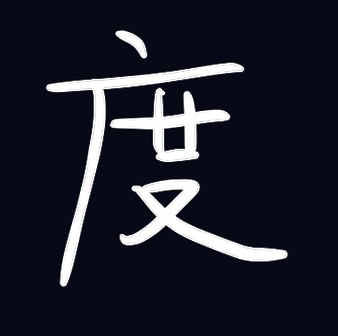

Writing process of "深"    |  Writing process of "度"
:-------------------------:|:-------------------------:
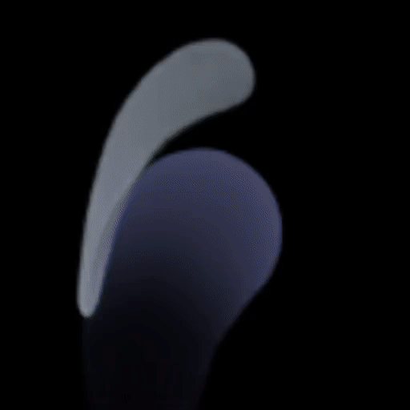  |  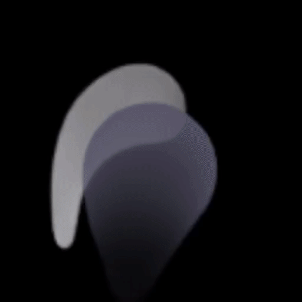

The picture above shows how the original model attempts to write 2 Chinese characters that mean "deep" in English. The original model used 250 strokes both to replicate the two characters, while in Chinese the correct way of writing those characters only requires 11 and 8 strokes, respectively.

Therefore, we largly modified the model so that it only focuses on structure of any given image. Here are some important aspects of the changes we made:
<ul>
<li> We reduced the number of channels of the target image and the current canvas in our state representation to 1 from 3, so that we treat all given images as having on grayscale values.
<li> We simplified the architectures of the actor and the critic, which are two ResNets, so that they only focus on the structure of given images, rather than textures.
<li> We modified the discriminator so that it generates large rewards for long and thin strokes and penalize small and thick strokes.
<li> We modfiied the renderer so that it renders strokes in grayscale.
</ul>

After applying all the modification above (code is in _chinese-character_ branch), we obtained the following result on the same task:

Writing process of "深"    |  Writing process of "度"
:-------------------------:|:-------------------------:
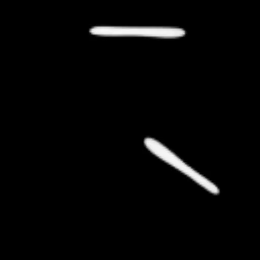  |  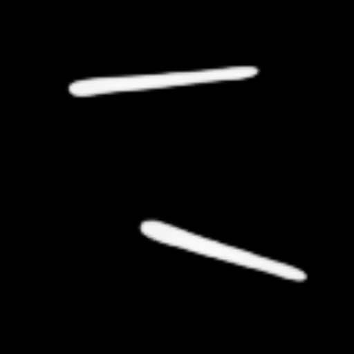

The picture above shows how our modified model writes the same 2 Chinese characters that mean "deep" in English. This time, our model used 22 strokes for both characters to accomplish the task, which is significantly less than what the original model needed. Moreover, the picture shows that the resulting images look much cleaner and more like how a human would write those characters.

## Learning to Paint with Style 
After exploring how to modify the model so that it focuses mostly on structures, we took the other extreme aspect, which is to explore how the model extracts the textures of given images.

For this experiment, we modified the original implementation by adding the style transfer implementation. We tuned the models based on pretrained weights given by the author.
### Discussion
We applied the style transfer implementation from [this repo](https://github.com/zhanghang1989/PyTorch-Multi-Style-Transfer). It uses the Multi-style Generative Network.

Since we can treat styling information as a code, we just need to think of where we should embed this information into the agent. Of course, it is possible to transfer the entire image with style before or after the entire painting process. However, it lacks the fun of training the agent and see how the original model would perform. Therefore, we suggested three different places to add the styling information, as shown below.

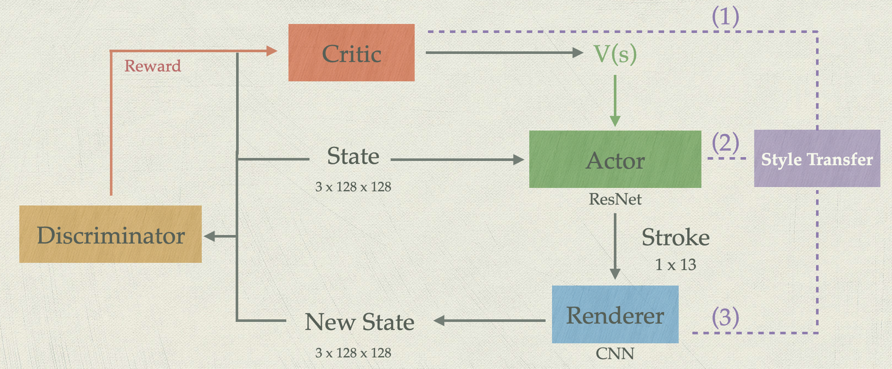

<ol>
<li> Input styled target into the critic for calculation.
<li> Embed the infomration in actor to generate styled action and directly apply the styled action in the renderer.
<li> Embed the information in renderer, so the renderer would generate styled state.
</ol>

After the brainstorming and experiments, we got some results:

For the first method, the model did not coverage. We thought the issue could reside in the problem set-up. Since learning from original image but comparing with styled iamge is too hard for model to learn.

The second option did not converage well, it might because we didn't tune the hyperparameters well or we did not have a good model architecture.

For the third option, instead of training a new renderer with style transfer, we would simplly pass the output of the renderer into the style transfer model. By doing this, it avoids the probability of model divergence and saves time. Training a new nerual renderer requrires high computational power.
### Visual Results
| Target Image | Style Image | Output |
|--------------|-------------|--------|
|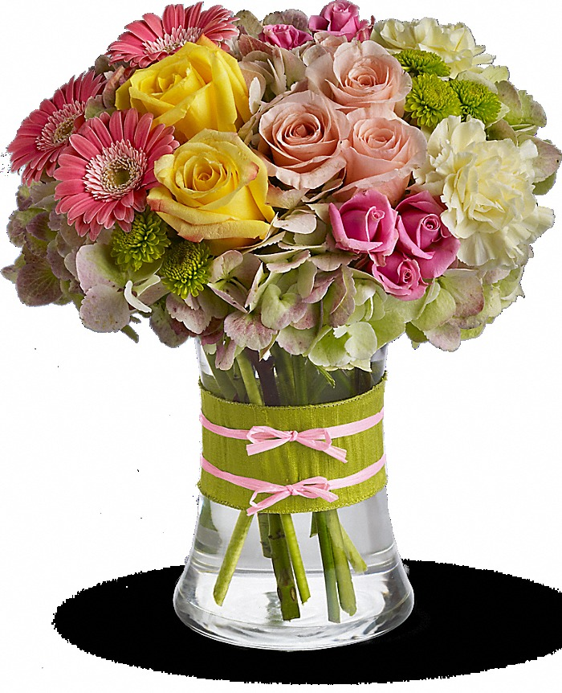|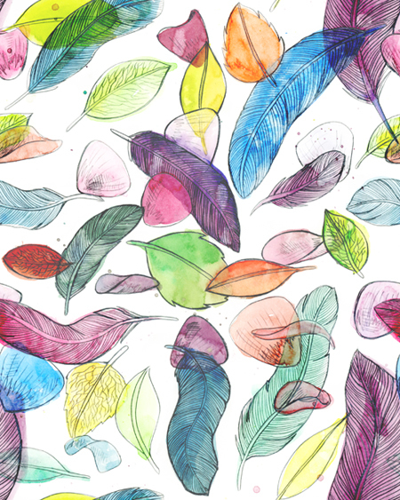||
|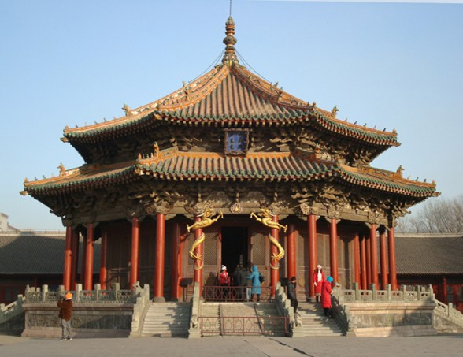|||
|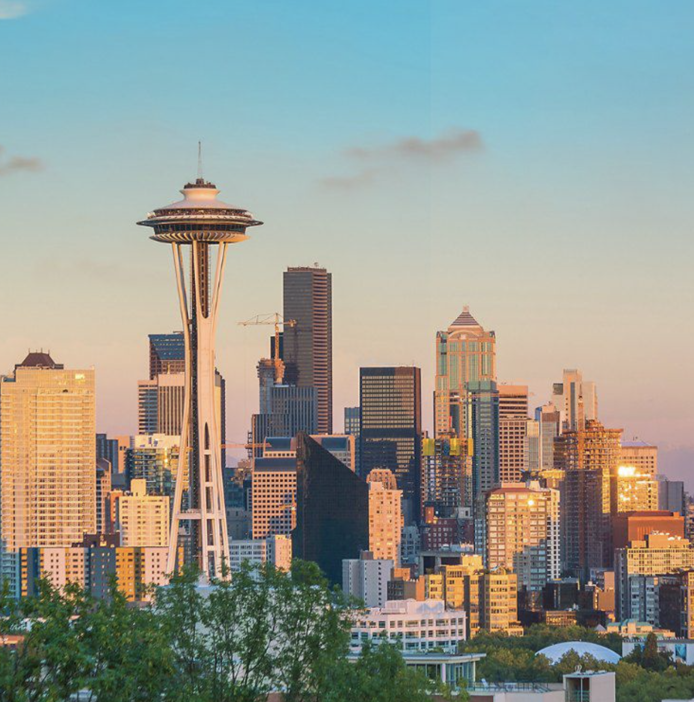|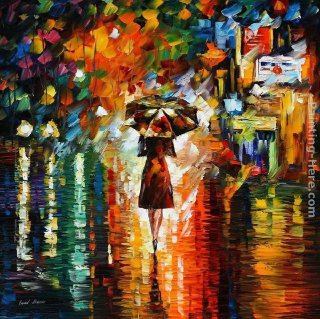||

### Cross-Section Result
After experimenting the previous two extreme approaches, we were curious how our model with style transfer would perform when an image of a Chinese character is given to it. We attempted on that and here is the result:

| Target Image | Style Image | Output |
|--------------|-------------|--------|
|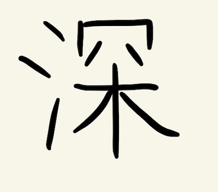|||
|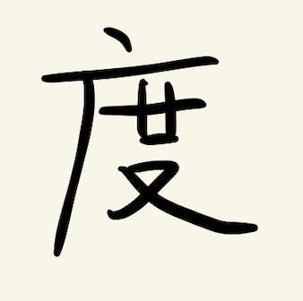|||
|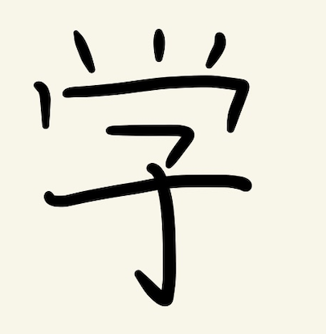|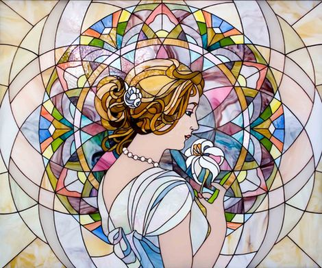||
|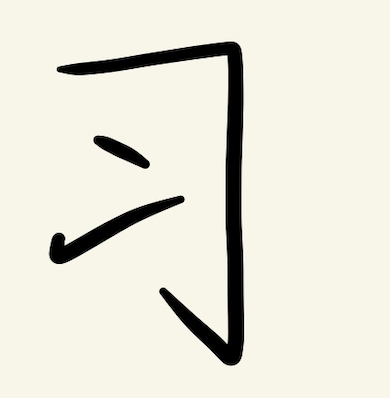|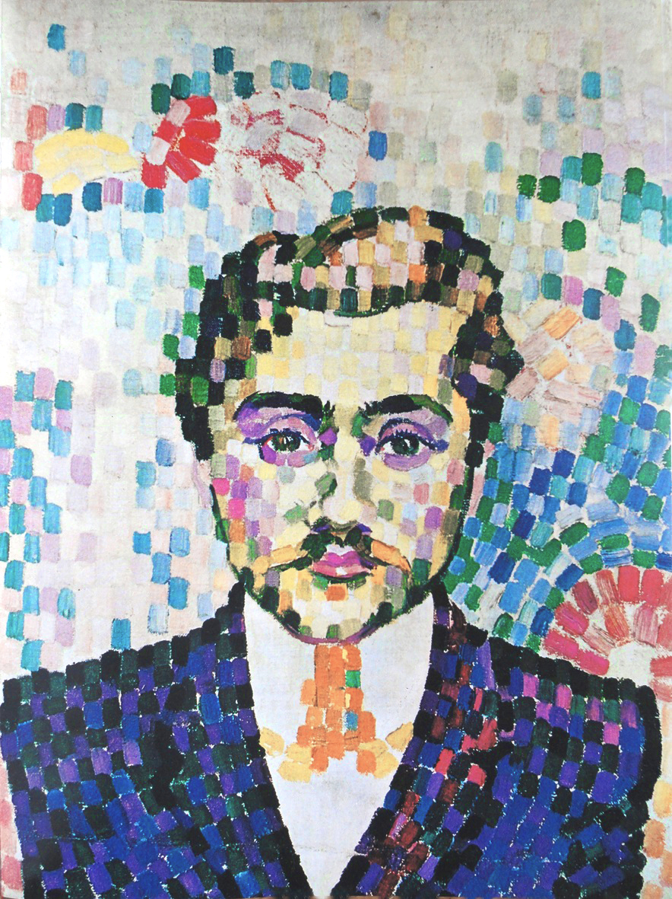||

As shown in the picture, it indeed renders the given character using the given style. But the style is mostly demonstrated more in the background of the character, rather than the character itself. This is actully expected behavior, because a Chinese character does not have too much texture embed in the strokes.

## Conclusion
In this project, we experienced how to adapt an existing work that decompose a given image into a sequence of strokes to our specific tasks. We took two distinct approches to fully comprehend the original work. We first focused on enhancing the ability of the model to identify structures of a given image by modifying and training an agent that writes Chinese characters that mimics how a human would do so. Then we focused on enhancing the ability of the model to capture textures of the a given image and further apply different style transfers to the image. In order to do so, we incorperated another existing work on neural style transfer into our model so that on top of generating a sequence of strokes based on a given image, the agent renders those strokes using different styles based on another given image that supplies style information.
## Dataset
- [CelebA](http://mmlab.ie.cuhk.edu.hk/projects/CelebA.html) 

- [Handwritten Chinese Character (Hanzi) Datasets](https://www.kaggle.com/pascalbliem/handwritten-chinese-character-hanzi-datasets)
